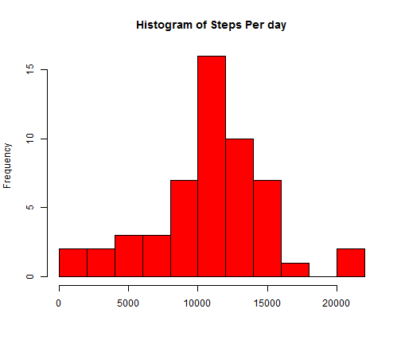
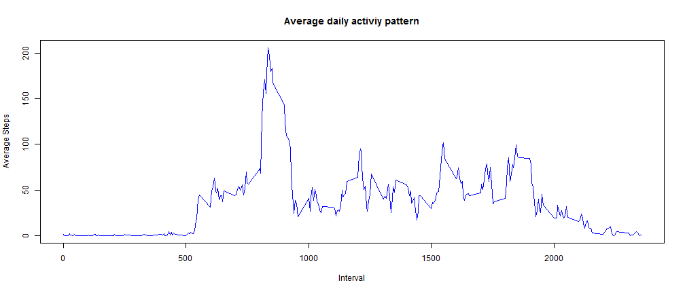
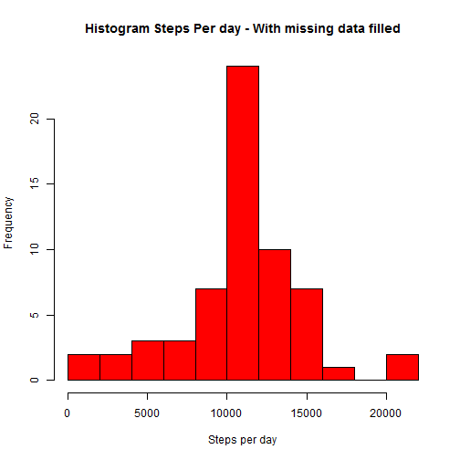
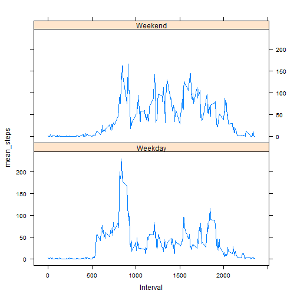

#  Coursera Reproduceable Research Project 1
    
Input data activity.csv is downloaded and is in the current working directory. Let's first load the required library and read the file using read.csv function.

## Loading Data ...
    

```r
library(plyr)
library(dplyr)
```

```
## 
## Attaching package: 'dplyr'
## 
## The following objects are masked from 'package:plyr':
## 
##     arrange, desc, failwith, id, mutate, summarise, summarize
## 
## The following objects are masked from 'package:stats':
## 
##     filter, lag
## 
## The following objects are masked from 'package:base':
## 
##     intersect, setdiff, setequal, union
```

```r
library(lattice)
col_names = c("Steps", "Date", "Interval")
col_classes = c('character','character', 'numeric')
activity_raw = read.csv("activity.csv", sep=",", quote = "\"", header=T, colClasses=col_classes, col.names=col_names, na.strings="NA")
dim(activity_raw)
```

```
## [1] 17568     3
```

## Pre processing data ...
We filter out NA records, convert date to Date format and store in "Date" column, then summarize data per day and get data ready for histogram.
    

```r
activity = na.omit(activity_raw)
activity$Date = as.Date(activity$Date, format="%Y-%m-%d")
activity$Steps = as.numeric(activity$Steps)
str(activity)
```

```
## 'data.frame':	15264 obs. of  3 variables:
##  $ Steps   : num  0 0 0 0 0 0 0 0 0 0 ...
##  $ Date    : Date, format: "2012-10-02" "2012-10-02" ...
##  $ Interval: num  0 5 10 15 20 25 30 35 40 45 ...
##  - attr(*, "na.action")=Class 'omit'  Named int [1:2304] 1 2 3 4 5 6 7 8 9 10 ...
##   .. ..- attr(*, "names")= chr [1:2304] "1" "2" "3" "4" ...
```

```r
act = ddply(activity, c("Date"), summarize, total_steps=sum(Steps))
str(act)
```

```
## 'data.frame':	53 obs. of  2 variables:
##  $ Date       : Date, format: "2012-10-02" "2012-10-03" ...
##  $ total_steps: num  126 11352 12116 13294 15420 ...
```


## Histogram ...
Histogram of total number of steps taken per day is 


```r
with(act, hist(act$total_steps, col="red", main="Histogram of Steps Per day", xlab="", breaks=14))
```

 

## Mean and Median Steps per day ...

Mean and median per day is this

```r
ddply(activity, c("Date"), summarize, total_steps=sum(Steps), mean_steps=mean(Steps), median_steps = median(Steps))
```

```
##          Date total_steps mean_steps median_steps
## 1  2012-10-02         126     0.4375            0
## 2  2012-10-03       11352    39.4167            0
## 3  2012-10-04       12116    42.0694            0
## 4  2012-10-05       13294    46.1597            0
## 5  2012-10-06       15420    53.5417            0
## 6  2012-10-07       11015    38.2465            0
## 7  2012-10-09       12811    44.4826            0
## 8  2012-10-10        9900    34.3750            0
## 9  2012-10-11       10304    35.7778            0
## 10 2012-10-12       17382    60.3542            0
## 11 2012-10-13       12426    43.1458            0
## 12 2012-10-14       15098    52.4236            0
## 13 2012-10-15       10139    35.2049            0
## 14 2012-10-16       15084    52.3750            0
## 15 2012-10-17       13452    46.7083            0
## 16 2012-10-18       10056    34.9167            0
## 17 2012-10-19       11829    41.0729            0
## 18 2012-10-20       10395    36.0938            0
## 19 2012-10-21        8821    30.6285            0
## 20 2012-10-22       13460    46.7361            0
## 21 2012-10-23        8918    30.9653            0
## 22 2012-10-24        8355    29.0104            0
## 23 2012-10-25        2492     8.6528            0
## 24 2012-10-26        6778    23.5347            0
## 25 2012-10-27       10119    35.1354            0
## 26 2012-10-28       11458    39.7847            0
## 27 2012-10-29        5018    17.4236            0
## 28 2012-10-30        9819    34.0938            0
## 29 2012-10-31       15414    53.5208            0
## 30 2012-11-02       10600    36.8056            0
## 31 2012-11-03       10571    36.7049            0
## 32 2012-11-05       10439    36.2465            0
## 33 2012-11-06        8334    28.9375            0
## 34 2012-11-07       12883    44.7326            0
## 35 2012-11-08        3219    11.1771            0
## 36 2012-11-11       12608    43.7778            0
## 37 2012-11-12       10765    37.3785            0
## 38 2012-11-13        7336    25.4722            0
## 39 2012-11-15          41     0.1424            0
## 40 2012-11-16        5441    18.8924            0
## 41 2012-11-17       14339    49.7882            0
## 42 2012-11-18       15110    52.4653            0
## 43 2012-11-19        8841    30.6979            0
## 44 2012-11-20        4472    15.5278            0
## 45 2012-11-21       12787    44.3993            0
## 46 2012-11-22       20427    70.9271            0
## 47 2012-11-23       21194    73.5903            0
## 48 2012-11-24       14478    50.2708            0
## 49 2012-11-25       11834    41.0903            0
## 50 2012-11-26       11162    38.7569            0
## 51 2012-11-27       13646    47.3819            0
## 52 2012-11-28       10183    35.3576            0
## 53 2012-11-29        7047    24.4688            0
```

## Average daily activity pattern ...

```r
act_interval = ddply(activity, c("Interval"), summarize, mean_steps=mean(Steps))
with(act_interval, plot(Interval, mean_steps, type="l", col="blue", main="Average daily activiy pattern", xlab="Interval", ylab="Average Steps"))
```

 

###  5-miniute interval with maximum number of steps


```r
act_interval[which.max(act_interval$mean_steps),,]
```

```
##     Interval mean_steps
## 104      835      206.2
```


## Imputing missing values ...

Total number of missing values in data set is 

```r
nrow(activity_raw) - nrow(activity)
```

```
## [1] 2304
```

Now lets device a Strategy to fill missing values. We cannot use daily averages because there are 8 full days for which data is missing. So we will use mean of the 5 minute interval as strategy to use missing values. To do this we will merge two data sets. We merge original raw data and mean for every interval data by Interval column. Then we add a new column new_steps to the data frame. This new_steps column will be equal to Steps is Steps is not NA. Else we make new_steps to be equal to mean for that interval.


```r
act_merge = merge(activity_raw, act_interval, by="Interval")
act_merge = mutate(act_merge, new_steps=(ifelse((is.na(Steps)), mean_steps, Steps)))
act_merge$new_steps = as.numeric(act_merge$new_steps)
dim(act_merge)
```

```
## [1] 17568     5
```

```r
a = ddply(act_merge, c("Date"), summarize, total_steps=sum(new_steps))
```

New histogram of total steps per day with missing filled in is ...

```r
act = ddply(act_merge, c("Date"), summarize, total_steps=sum(new_steps))
with(act, hist(act$total_steps, col="red", main="Histogram Steps Per day - With missing data filled", xlab="Steps per day", breaks=14))
```

 

New mean and median with missing data filled in is ...

```r
act_mean_median = ddply(act_merge, c("Date"), summarize, total_steps=sum(new_steps), mean_steps=mean(new_steps), median_steps = median(new_steps))
head(act_mean_median, 61)
```

```
##          Date total_steps mean_steps median_steps
## 1  2012-10-01       10766    37.3826        34.11
## 2  2012-10-02         126     0.4375         0.00
## 3  2012-10-03       11352    39.4167         0.00
## 4  2012-10-04       12116    42.0694         0.00
## 5  2012-10-05       13294    46.1597         0.00
## 6  2012-10-06       15420    53.5417         0.00
## 7  2012-10-07       11015    38.2465         0.00
## 8  2012-10-08       10766    37.3826        34.11
## 9  2012-10-09       12811    44.4826         0.00
## 10 2012-10-10        9900    34.3750         0.00
## 11 2012-10-11       10304    35.7778         0.00
## 12 2012-10-12       17382    60.3542         0.00
## 13 2012-10-13       12426    43.1458         0.00
## 14 2012-10-14       15098    52.4236         0.00
## 15 2012-10-15       10139    35.2049         0.00
## 16 2012-10-16       15084    52.3750         0.00
## 17 2012-10-17       13452    46.7083         0.00
## 18 2012-10-18       10056    34.9167         0.00
## 19 2012-10-19       11829    41.0729         0.00
## 20 2012-10-20       10395    36.0938         0.00
## 21 2012-10-21        8821    30.6285         0.00
## 22 2012-10-22       13460    46.7361         0.00
## 23 2012-10-23        8918    30.9653         0.00
## 24 2012-10-24        8355    29.0104         0.00
## 25 2012-10-25        2492     8.6528         0.00
## 26 2012-10-26        6778    23.5347         0.00
## 27 2012-10-27       10119    35.1354         0.00
## 28 2012-10-28       11458    39.7847         0.00
## 29 2012-10-29        5018    17.4236         0.00
## 30 2012-10-30        9819    34.0938         0.00
## 31 2012-10-31       15414    53.5208         0.00
## 32 2012-11-01       10766    37.3826        34.11
## 33 2012-11-02       10600    36.8056         0.00
## 34 2012-11-03       10571    36.7049         0.00
## 35 2012-11-04       10766    37.3826        34.11
## 36 2012-11-05       10439    36.2465         0.00
## 37 2012-11-06        8334    28.9375         0.00
## 38 2012-11-07       12883    44.7326         0.00
## 39 2012-11-08        3219    11.1771         0.00
## 40 2012-11-09       10766    37.3826        34.11
## 41 2012-11-10       10766    37.3826        34.11
## 42 2012-11-11       12608    43.7778         0.00
## 43 2012-11-12       10765    37.3785         0.00
## 44 2012-11-13        7336    25.4722         0.00
## 45 2012-11-14       10766    37.3826        34.11
## 46 2012-11-15          41     0.1424         0.00
## 47 2012-11-16        5441    18.8924         0.00
## 48 2012-11-17       14339    49.7882         0.00
## 49 2012-11-18       15110    52.4653         0.00
## 50 2012-11-19        8841    30.6979         0.00
## 51 2012-11-20        4472    15.5278         0.00
## 52 2012-11-21       12787    44.3993         0.00
## 53 2012-11-22       20427    70.9271         0.00
## 54 2012-11-23       21194    73.5903         0.00
## 55 2012-11-24       14478    50.2708         0.00
## 56 2012-11-25       11834    41.0903         0.00
## 57 2012-11-26       11162    38.7569         0.00
## 58 2012-11-27       13646    47.3819         0.00
## 59 2012-11-28       10183    35.3576         0.00
## 60 2012-11-29        7047    24.4688         0.00
## 61 2012-11-30       10766    37.3826        34.11
```

Of 61 days of data recorded, 8 days of full data was missing in data set. With missing data filled, we fill the data for those 8 days. Total steps for other days does not change. Also only for those 8 days we get a median which is greater than zero. The median for other 53 days remains the same which is zero.

## Difference in activity patterns in Weekdays and Weekends ...

First we create a new column that stores the weekday for the day for every record. Then we filter the resulting data set into two data sets one wich which is a weekday dataset and another whcih is a weekend data set.


```r
act_merge$Date = as.Date(act_merge$Date, format="%Y-%m-%d")
act_merge = mutate (act_merge, weekday = weekdays(act_merge$Date))

act_merge_weekday = filter(act_merge, weekday!='Saturday' & weekday!='Sunday')
act_merge_weekend = filter(act_merge, weekday=='Saturday' | weekday=='Sunday')

act_interval_weekday = ddply(act_merge_weekday, c("Interval"), summarize, mean_steps=mean(new_steps))
act_interval_weekday = mutate(act_interval_weekday, day='Weekday')

act_interval_weekend = ddply(act_merge_weekend, c("Interval"), summarize, mean_steps=mean(new_steps))
act_interval_weekend = mutate(act_interval_weekend, day='Weekend')
```

rbind the two data frames (weekday and weekend) to get one data frame. Then convert day to a factor variable. 

```r
act_interval_day = rbind(act_interval_weekday, act_interval_weekend)
act_interval_day = transform(act_interval_day, Day=factor(day))
xyplot(mean_steps ~ Interval | Day, data=act_interval_day, type="l", layout=c(1,2))
```

 
